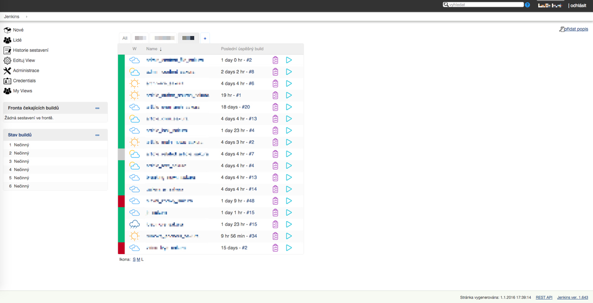

# jenkins-flat-theme

##Credits:
Based on Canon theme: https://github.com/rackerlabs/canon-jenkins  
Icons: http://www.flaticon.com  

##Installation:  
1. Install Simple theme plugin: https://wiki.jenkins-ci.org/display/JENKINS/Simple+Theme+Plugin  
2. Go to Jenkins > Manage Jenkins > Configure System  
3. Add this link: https://cdn.rawgit.com/nvldk/jenkins-flat-theme/master/style.css into "URL of theme CSS"

##Preview  

##Known issue:  
Doesn't work for Firefox but Safari and Chrome is ok.
